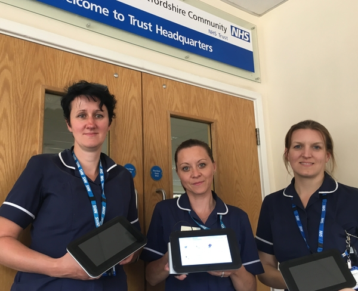
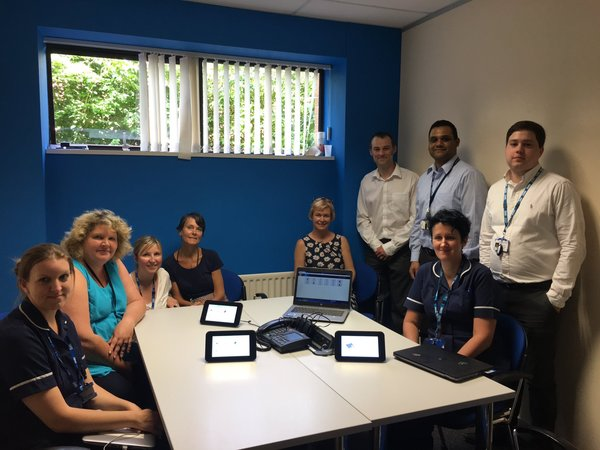

# NHS MediPi Remote Patient Monitoring/Telehealth System

MediPi is a clinically lead, community based, open platform development aimed at addressing those factors which have caused telehealth to be economically unattractive.

Distilled to its core, MediPi allows secure transmission of data from one or many satellite systems to a remote sever and can expose it through secure APIs to clinical systems. This is a model which lends itself to many clinical scenarios  

### Hertfordshire Community NHS Trust Pilot

MediPi has been developed in partnership with Hertfordshire Community NHS Trust. The solution has been tested as part a small scale pilot with patients who have conditions such as Heart Failure, COPD and Diabetes.   
Hertfordshire have stated that there is a saving of £70 for each nurse visit avoided, but this does not account for secondary benefits such as reduction in A&E visits, reduced caseload of clinicians etc. as well as the “softer” perceptual benefits which can be captured by patient and clinician surveys.

The physiological devices used in the pilot were:
* Scales
* Pulse Oximeter
* Blood Pressure Cuff
* Thermometer

Additionally, in response to clinicians' requests, we developed a daily subjective patient health yes/no questionnaire. The questionnaire is based on an existing paper flow chart which was created by Hertfordshire Trust nurses and it provides patients with standard instructions as a result of their subjective responses. The flexible user interface allows questionnaires to be designed specifically for the health conditions of each type of patient.

Measurements and information from these devices/interfaces was then transmitted securely to the MediPi Concentrator. From this central hub server approved systems can securely request patient data to process and present to clinicians. For the purposes of the pilot we developed a mock clinical system to perform these actions.

||
|:-----:|:-----:|
||

The GitHub repository has been used an open-source repository for all aspects of the project wherever possible. Other than code, this includes software testing results, Electromagnetic Conformance (EMC) testing etc...  
We have endeavoured to create extensive READMEs for all sections, with quick-start guides where applicable.

* [Patient Software](#medipi-patient-software)  
* [Host Concentrator Server Software](#medipi-host-concentrator-server)   
* [Mock-Clinical Server Software](#medipi-mock-clinical-server)  
* [Software Testing](https://github.com/rprobinson/MediPi/blob/master/SoftwareTesting/README.md)  
* [Electromagnetic Conformance (EMC) Testing](https://github.com/rprobinson/MediPi/blob/master/EMCTesting/README.md)  

---

### MediPi Patient Software
The patient software is designed to be used typically in a domestic setting by a patient to measure and transmit data to a remote clinician and to receive alerts/messages in return.
MediPi Open Source software is written using Java and so is platform independent allowing it to run on Linux, Windows or IOS systems. It a flexible solution enabling interaction with USB, Bluetooth, user input or internet-enabled data streams so it is not tied to any particular models or types of device. Its extensibility means that new devices can be plugged in and configured to work.
The MediPi Patient software has Element and device classes which allow the measurement of Blood Pressure, Oxygen saturation and weight measurements and take a daily subjective patient health yes/no questionnaire. The questionnaire was created by Heart Failure nurses based on an existing paper flow chart that provides patients with standard instructions as a result of their responses. In this way, clinicians can monitor how patients are feeling subjectively. The MediPi patient unit schedules the taking of these measurements and securely transmits the data to the MediPi Host Concentrator. It can also receive text based alert messages directly from a clinical application through its APIs as a result of transmitted readings. The software or configuration can be remotely updated per device.

[MediPi Patient Unit Software](https://github.com/rprobinson/MediPi/blob/master/MediPiPatient)  

Patient User Documentation:
* [MediPi Patient User Guide Document](https://github.com/rprobinson/MediPi/blob/master/documents/MediPi_Patient_Guide_v1.3.docx)  
* [Letter to MediPi Participants](https://github.com/rprobinson/MediPi/blob/master/documents/MediPi_Patient_Letter_v1.0.docx)  
* [Patient User Guide for use of Nonin Pulse Oximeter](https://github.com/rprobinson/MediPi/blob/master/documents/Patient_Guide_for_use_of_Nonin_9560_Pulse_Oximeter.docx)

Clinician/Technical User Documentation:
* [Guide to setting up the MediPi Patient User Device in the home](https://github.com/rprobinson/MediPi/blob/master/documents/MediPi_Patient_Unit_Administration_Mode-Clinician_Guide_v1.2.docx)  
* [Technical Guide to configuring the MediPi Patient User Device including pairing devices ](https://github.com/rprobinson/MediPi/blob/master/documents/MediPi_Patient_Unit_Administration_Mode-Full_Technical_Guide_v1.1.docx)  

---

### MediPi Host Concentrator Server
The host concentrator stores all the patient data per Trust and exposes APIs for clinical systems to request patient data from. These systems can then send alerts to the patient through the concentrator based on clinically defined thresholds (per patient, per measurement device).

MediPi Patient and MediPi Concentrator software has been designed from the ground-up to securely pass raw data from front end interfaces and physiological devices to the MediPi Concentrator - specifically not to 'process' or interpret the data in any way. As a result, and after consultation with MHRA (Medicines & Healthcare products Regulatory Agency), we believe that the system software (MediPi Patient and MediPi Concentrator) is classed as a ‘Health IT system’ falling under the clinical risk management standard SCCI 0129,  "not a medical device". However any parties using or modifying the code would need to re-establish this with MHRA.

[MediPi Concentrator Server Software](https://github.com/rprobinson/MediPi/blob/master/MediPiConcentrator)

---

### MediPi Mock-Clinical Server
The mock-clinical system has been developed as part of the pilot to allow clinicians access to their patient's data. It requests data periodically from the concentrator through the concentrator's API. Any new data is tested against configured thresholds and alerts are returned to the patient based upon this calculation. The web based front end is used by clinicians to log on to and presents them with a single screen digest of their cohort of patients. Each patient is displayed with a status indicator reflecting the data they have submitted. Clinicians can access the patient's record which will show graphical history of each submitted measurement and the current status. This allows them to review and update thresholds for each device. The advantage of implementing a mock clinical system is that we maintian end-to-end control of the software for the pilot, however the ultimate aim is that thrid party systems will use the concentrator's APIs to perform this function. As the MediPi mock-clinical system makes caluculations based upon the measurement thresholds, it has been submitted and approved as a medical device with the MHRA.

[MediPi Clinical Server Software](https://github.com/rprobinson/MediPi/blob/master/Clinician)

Clinician User Documentation:
* [Clinician User Guide to the MediPi Patient Observation Screens](https://github.com/rprobinson/MediPi/blob/master/documents/Guide_To_the_MediPi_Patient_Observation_Screen_v1.2.docx)  

---

### MediPi Transport Tools/Security
MediPi Patient and Concentrator exchange data using secure 2-way SSL/ Mutually Authenticated messaging and the concentrator exposes APIs to Clinical systems using the same. Additionally, data is exchanged using data objects which have been encrypted and signed using JSON Web encryption objects and JSON Web Signing objects. We have published a common library of tools for this purpose.

[MediPi Transport Tools Software](https://github.com/rprobinson/MediPi/blob/master/Commons/MediPiTransportTools)
